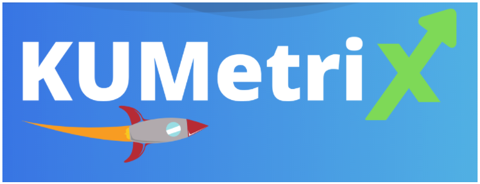
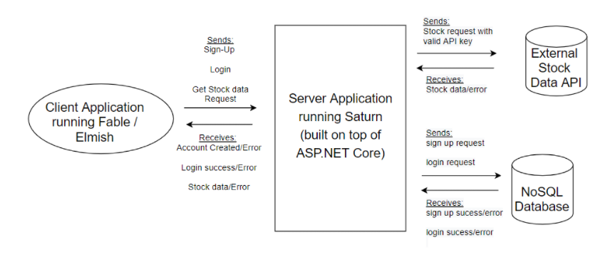
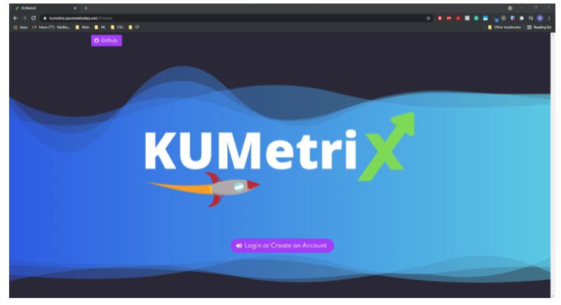
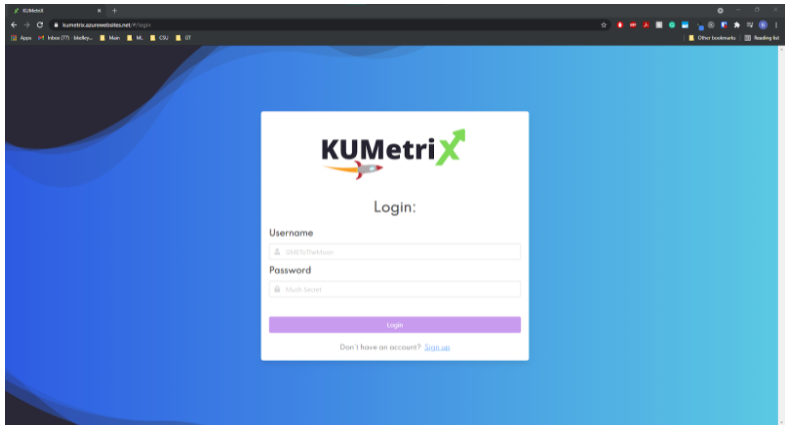
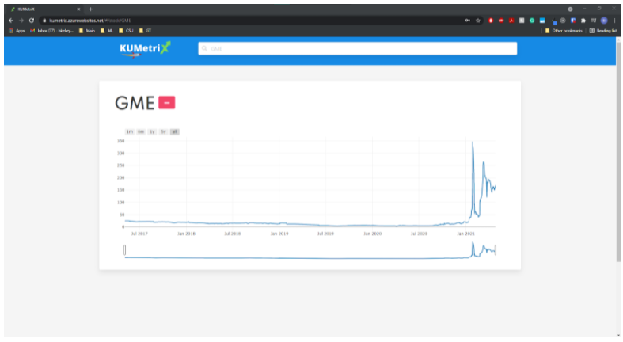

  
  
  
  
  
  

The website link: [Kumetrix](https://kumetrix.azurewebsites.net/)

Github link: [Github](https://github.com/bkelley616/KUMetriX-Public) 

<h5>Description</h5>

KUMetriX is a stock tracking app that allows the user to create an account or log in to which they are then taken to a dashboard with a search input on the navigation bar. The search bar allows users to search for a stock ticker and receive recent and historical data of the chosen stock using an interactive graph. The user will then be able to add their favorite stocks to their dashboard to be able to quickly access them upon secure login. Furthermore, the website will feature a fully responsive mobile first design that will be intuitive for the user to navigate and use.

The SAFE stack project has the client application (Front-End)
build using the Fable compiler along with the Elmish state management
system to provide a performant UI that uses the MVU pattern of state
management, and the backend was built with Saturn which is an F# library
that allows routing and hosting applications that are built on top of ASP .NET
Core.

<h5>Conclusion</h5>
This project was built by Me and two of my teammates for our CIS 408 Internet Programming course.

