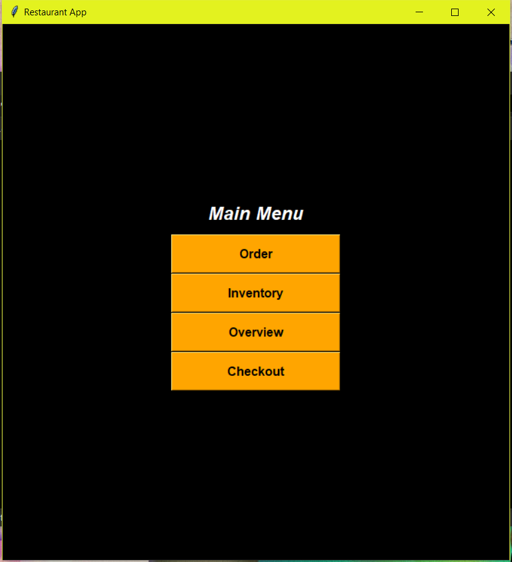

<div class="ui small rounded images">
  
</div>

Me and my group created a Restaurant Ordering System in Python using the Tkinterlibrary for my Software Engineering course. We used MySQL for our backend database storage. I was in charge of the UI of the program and was responsible for making the Front End connect with the Logic of the program and also use the Database to store the proper Orders.

Here is some code that illustrates how we handled Front End GUI code:

```python
 def __init__(self, controller):
        super().__init__()

        self.title_font = tkfont.Font(family='Helvetica', size=18, weight="bold", slant="italic")
        self.button_font = tkfont.Font(family='Helvetica', size=12, weight="bold")

        self.title("Restaurant App")

        self.controller = controller

        self.value_var = tk.StringVar()

        container = tk.Frame(self)
        container.pack(side="top", fill="both", expand=True)
        container.grid_rowconfigure(0, weight=1)
        container.grid_columnconfigure(0, weight=1)

        self.frames = {"StartPage": StartPage(parent=container, controller=self),
                       "Order": Order(parent=container, controller=self),
                       "inventory_view": inventory_view(parent=container, controller=self),
                       "Overview": Overview(parent=container, controller=self),
                       "Checkout": Checkout(parent=container, controller=self),
                       "Create_order": Create_order(parent=container, controller=self),
                       "t_Total": t_Total(parent=container),
                       "New": New(parent=container)}

        self.frames["StartPage"].grid(row=0, column=0, sticky="nsew")
        self.frames["Order"].grid(row=0, column=0, sticky="nsew")
        self.frames["inventory_view"].grid(row=0, column=0, sticky="nsew")
        self.frames["Overview"].grid(row=0, column=0, sticky="nsew")
        self.frames["Checkout"].grid(row=0, column=0, sticky="nsew")
        self.frames["Create_order"].grid(row=0, column=0, sticky="nsew")
        self.frames["t_Total"].grid(row=0, column=0, sticky="nsew")
        self.frames["New"].grid(row=0, column=0, sticky="nsew")

        self.show_frame("StartPage")
```


